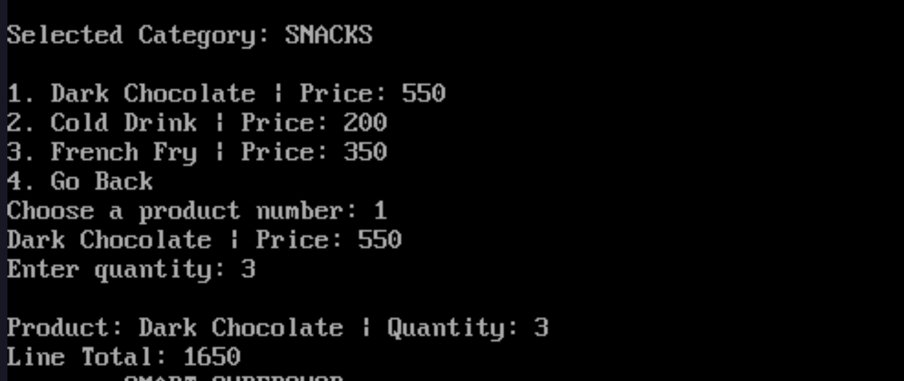
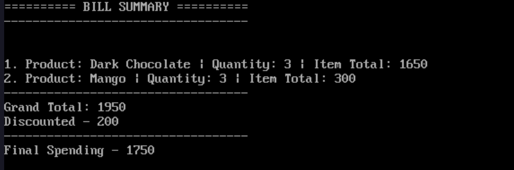
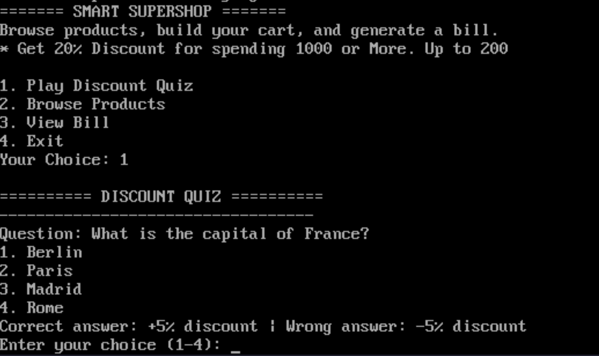
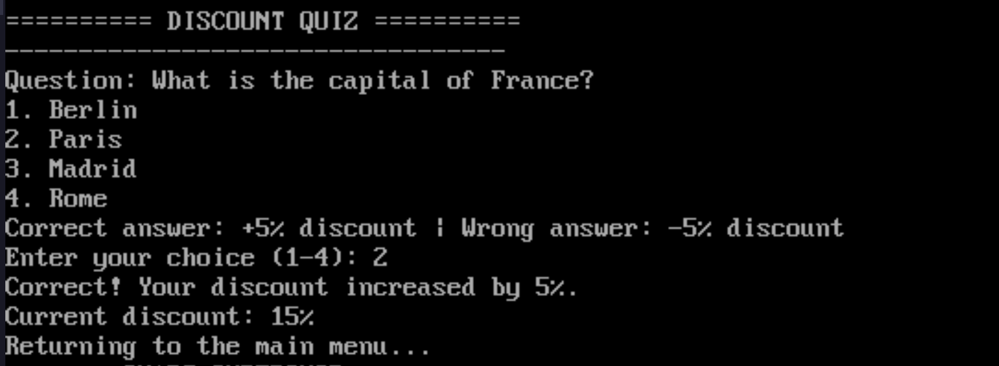

# 🛒 Smart Supershop

A comprehensive Point-of-Sale (POS) simulation developed in **8086 Assembly Language**. Smart Supershop allows users to browse categorized products, manage a shopping cart, play a discount quiz to earn rewards, and generate a detailed final bill.

##  Features

### 1.  Product Browsing & Purchasing
Users can navigate through multiple product categories and add items to their cart with specified quantities.
- **Categories**: Snacks, Vegetables, Fruits, Beverages, and Dairy.
- **Catalog Size**: 5 categories with 10 products in each category.
- **Real-time Calculation**: Automatically calculates line totals based on product price and quantity.
- **Cart Management**: Keeps track of up to 20 unique items.

### 2.  Dynamic Bill Generation
A detailed summary of the shopping experience is generated at the end.
- **Itemized List**: Displays the product name, quantity, and total cost for each item.
- **Grand Total**: Calculates the sum of all purchases.
- **Automated Discounts**: Applies conditional discounts based on total spending and quiz performance.

### 3.  Discount Quiz
An interactive element that allows users to influence their final bill.
- **Reward System**: Correct answers increase the total discount percentage by **5%**, while incorrect answers decrease it by **5%**.
- **One-time Participation**: Users can only take the quiz once per session.

---

## ⚙️ Project Configuration

The project uses the following logic for discounts and cart limits:

| Parameter | Value | Description |
| :--- | :--- | :--- |
| `MAX_BILL_ITEMS` | 20 | Maximum number of items allowed in the bill. |
| `Required Spending` | 1000 | Minimum spending required to trigger a discount. |
| `Discount Cap` | 200 | The maximum possible discount amount allowed. |
| `Base Discount` | 10% | Starting discount percentage. |

## 🛠️ Technical Details

- **Language**: Assembly (8086)
- **Model**: Small
- **Architecture**: x86
- **Key Implementations**:
    - **`display_number`**: A custom procedure to convert 16-bit decimal numbers (DW) into ASCII for screen display.
    - **`display_list`**: A generic procedure to display lists of strings (categories).
    - **`print_string`**: Wrapper for DOS interrupt `21h` function `09h`.

## 💻 How to Run

1. **Requirements**: An 8086 emulator (e.g., **EMU8086** or **DOSBox** with TASM/MASM).
2. **Assembly**: Assemble the `main.asm` file using your preferred assembler.
3. **Link**: Link the object file to create the executable.
4. **Execute**: Run the resulting `.exe` file.

---
*Developed as part of an Assembly Language course project.*
